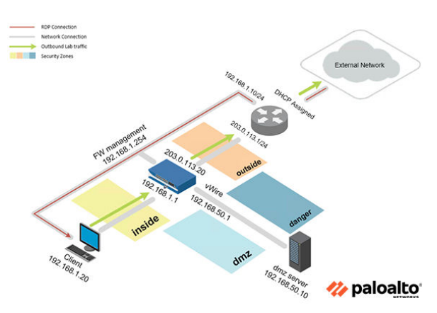
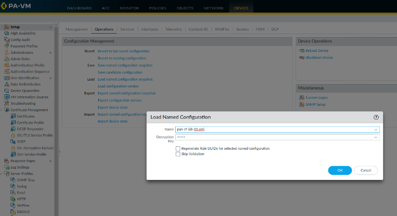
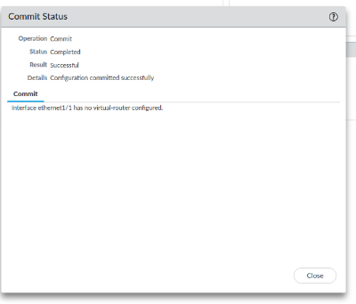
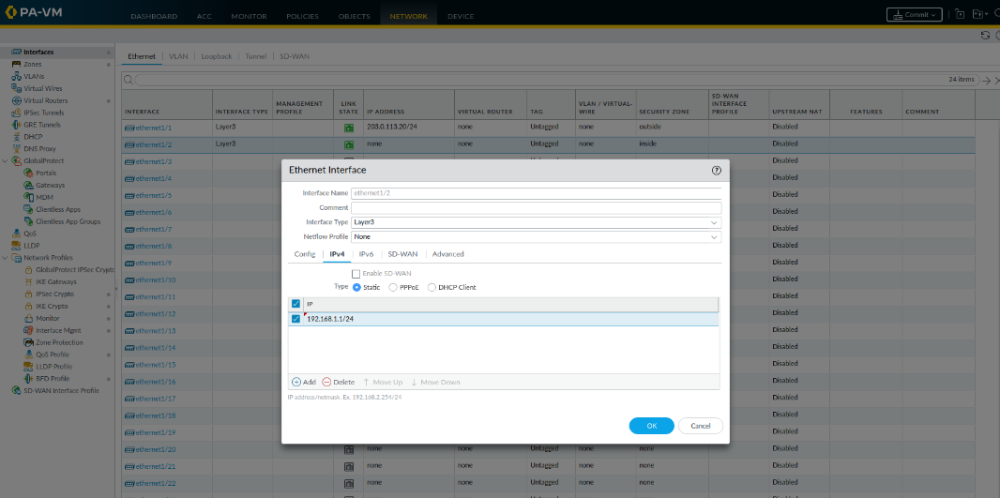
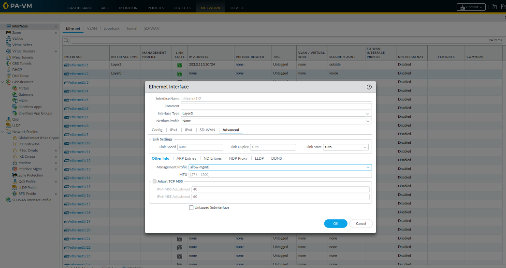
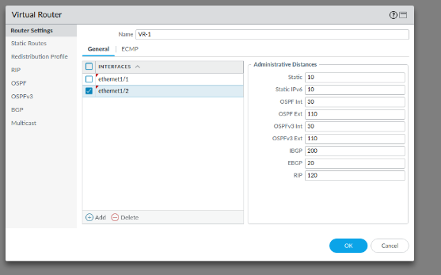
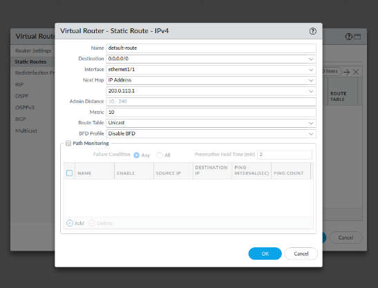
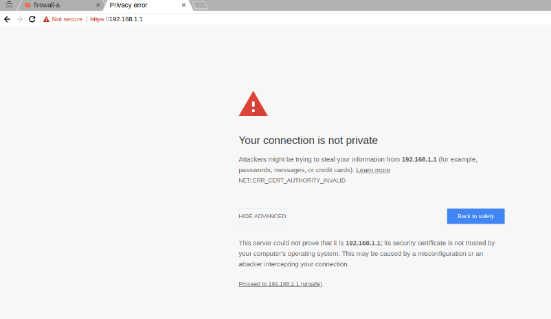
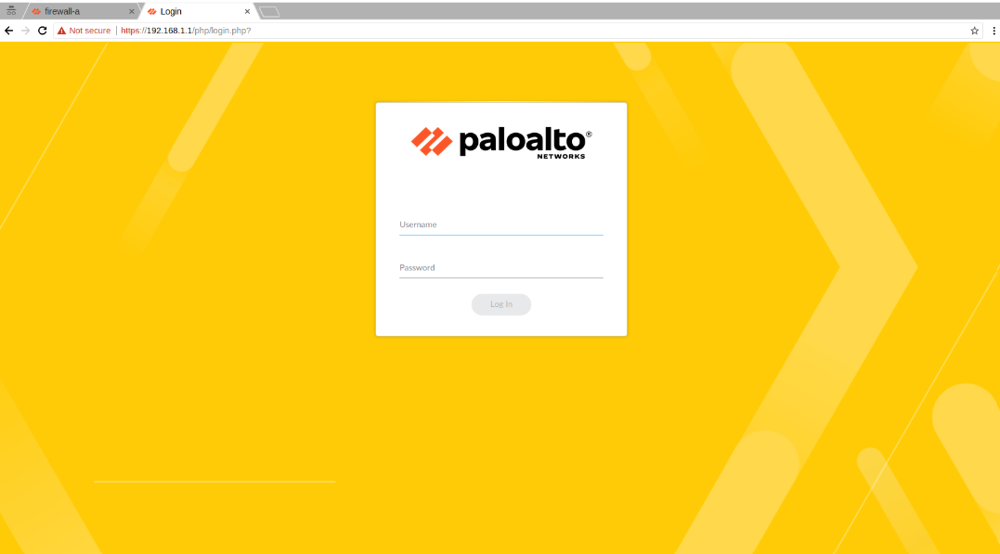

# Configuring TCP/IP and a Virtual Router

## Objective

- Configure Ethernet interfaces with Layer 3 information.
- Create a Virtual Router.
- Verify network connectivity.



---

## 1. Load Lab Configuration



1. Open **Chromium**.
2. Browse to **https://192.168.1.254**.
3. Log in to the Firewall web interface.
4. Navigate to:

   **Device → Setup → Operations**

5. Under **Configuration Management**, click **Load Named Configuration Snapshot**.
6. Select the saved configuration file.
7. Wait until the loading process completes successfully.

---

## Commit Process



The commit process copies all pending configuration changes to the running configuration, making them active on the firewall.

---

## 2. Configure Ethernet Interfaces with Layer 3 Information

1. Open the Terminal.
2. Verify that the inside interface is unreachable by running:

```bash
ping 192.168.1.1
```

3. Navigate to:

**Network → Interfaces → Ethernet**





4. Configure **ethernet1/2** with the following settings:

| Parameter | Value |
|-----------|-------|
| Interface Type | Layer3 |
| Security Zone | inside |
| IPv4 Address | 192.168.1.1/24 |
| Management Profile | allow-mgmt |

5. Save the configuration.
6. Click **Commit**.

---

## 3. Create a Virtual Router

Navigate to:

**Network → Virtual Routers**



Create a new Virtual Router using the following configuration:

| Parameter | Value |
|-----------|-------|
| Name | VR-1 |
| Interfaces | ethernet1/1, ethernet1/2 |

### Configure Static Route



| Parameter | Value |
|-----------|-------|
| Name | default-route |
| Destination | 0.0.0.0/0 |
| Interface | ethernet1/1 |
| Next Hop | IP Address |
| Gateway | 203.0.113.1 |

Save the configuration and perform another **Commit**.

---

## 4. Verify Network Connectivity

Open the Terminal and run:

```bash
ping 192.168.1.1
```

The ping should now receive replies from the firewall.

Next, open Chromium and browse to:

```
https://192.168.1.1
```

Ignore the certificate warning and continue to the website.

The Firewall login page should appear.





---

## Result

In this lab, the following tasks were completed successfully:

- Configured a Layer 3 Ethernet interface.
- Assigned an IPv4 address.
- Applied a Management Profile.
- Created a Virtual Router.
- Configured a default static route.
- Verified connectivity using Ping and the Firewall web interface.