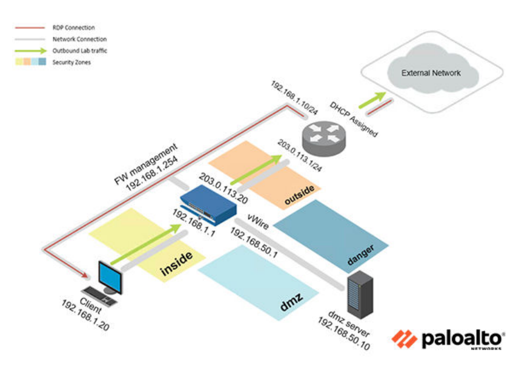
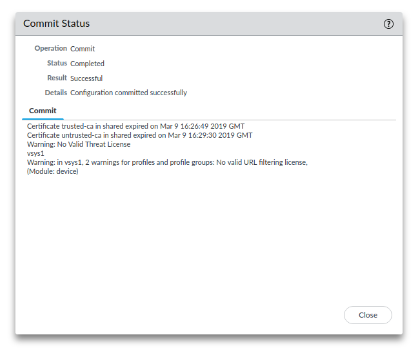
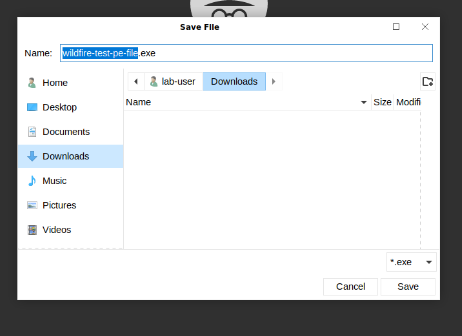
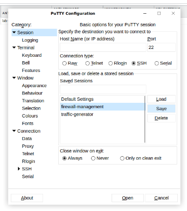
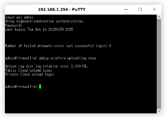
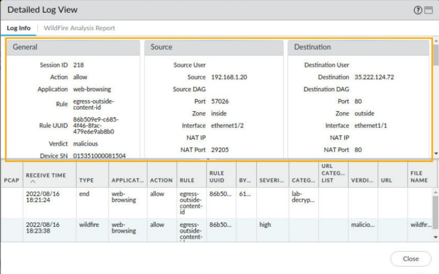

# MAlware Analysis

## Objective
- Configure and test a WildFire Analysis Security Profile and examine the Wildfire report 

--- 

## 1. Load Lab Configuration

## Commit Process

- After selected the saved configuration file

The commit process copies all pending configuration changes to the running configuration, making them active on the firewall.

---

## 2. Create a WildFire Analysis Profile 
1. Navigate to Objects > Security Profiles > Wildfire Analysis. Click Add.
2.  Type lab-wildfire for the Name, and WildFire Analysis for lab for the Description

---

## 3. Modify a Security Profile Group
1. Navigate to Objects > Security Profile Groups. Click lab-spg to open the Security Profile Group. 
2. select lab-wildfire for the WildFire Analysis Profile

## Commit Process

The commit process copies all pending configuration changes to the running configuration, making them active on the firewall.

---

## 3. Test the WildFire Analysis Profile 
1. New tab the search **http://wildfire.paloaltonetworks.com/publicapi/test/pe**
2. In the Save File window, leave the defaults and click Save.

3.  click the Putty icon, double-click firewall-management then click Accept

4. When prompted for login, type adminthen type debug wildfire upload-log show

5. Navigate to Monitor > Logs > WildFire Submissions,  Click the magnifying glass icon 

---
